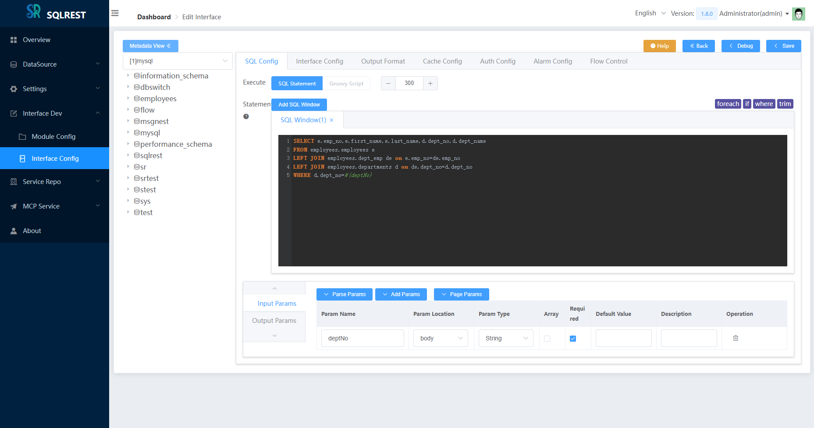
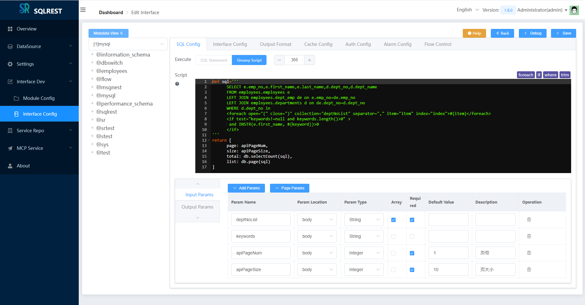
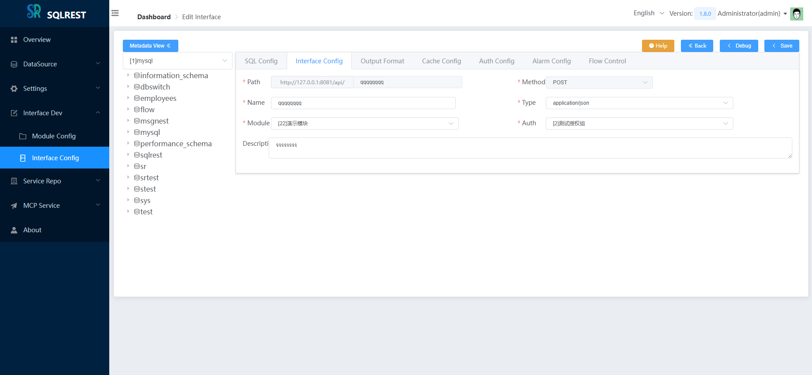
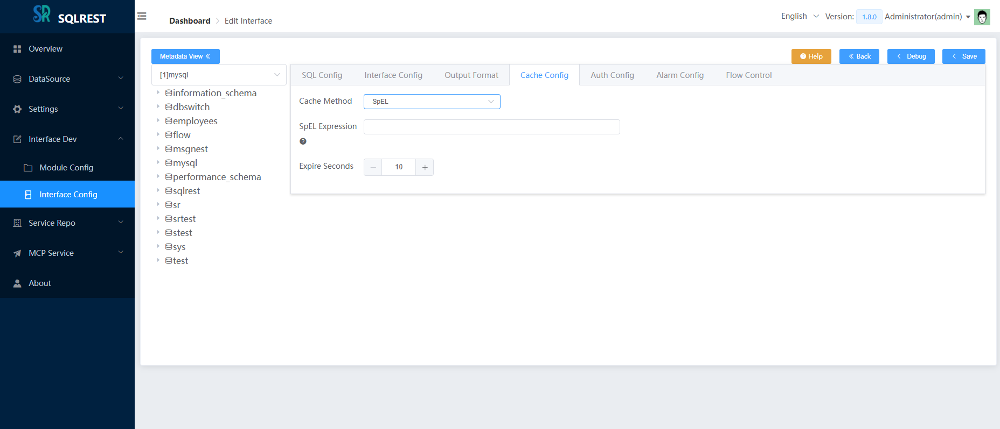
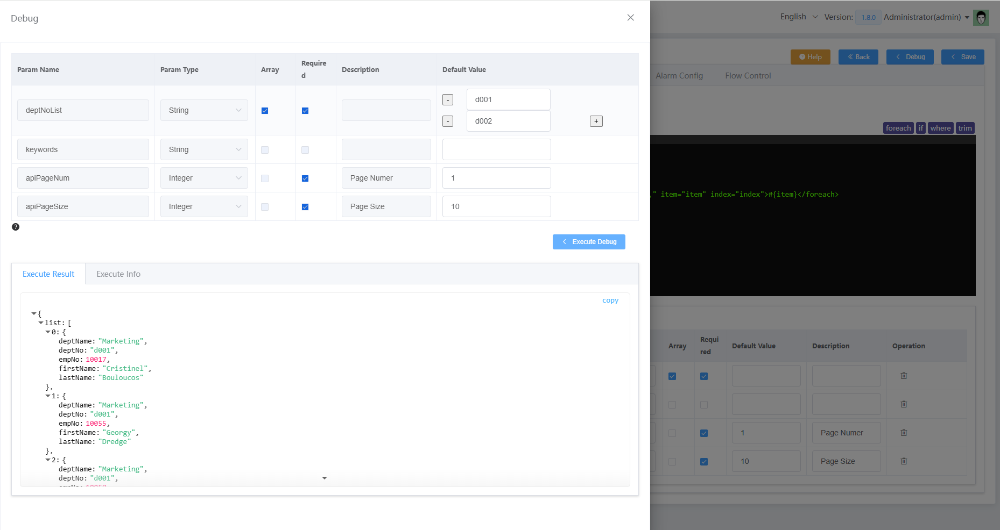
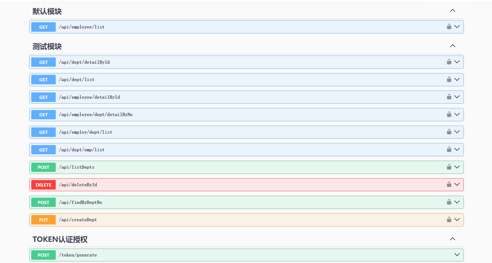
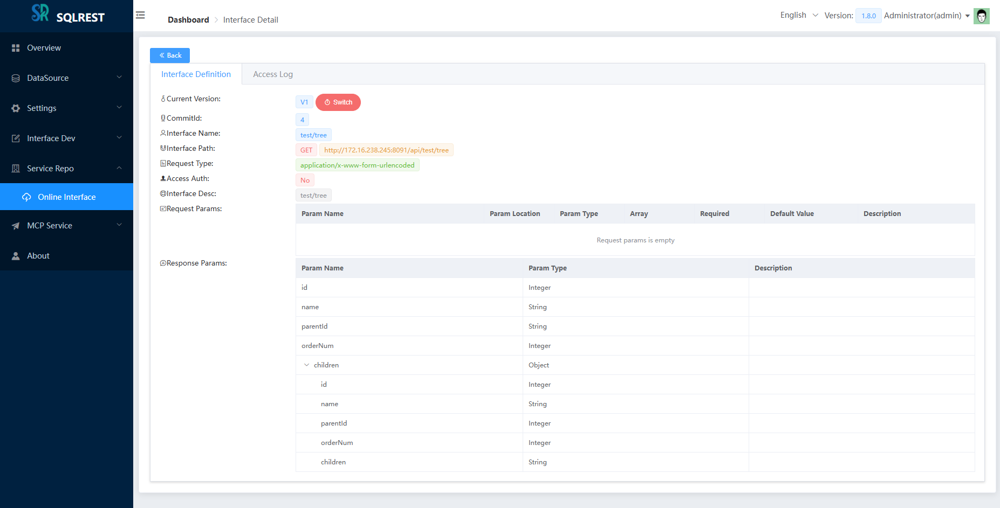
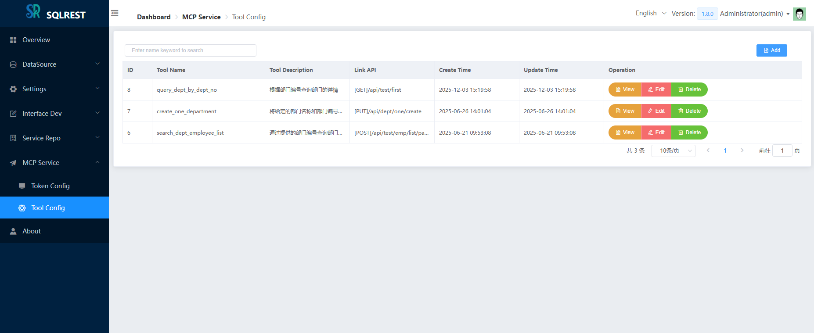
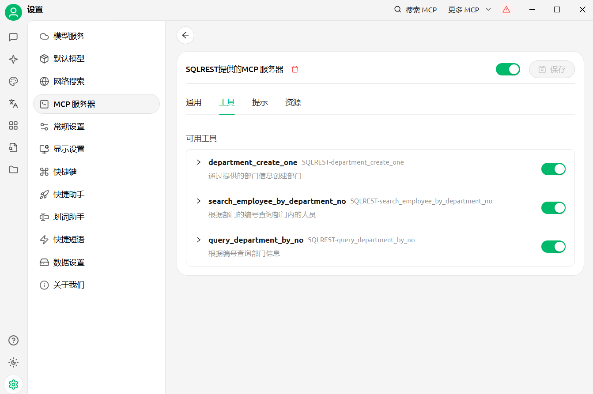

Language: [简体中文](README.zh.md) [English](README.md)

> A convenient tool that transforms SQL operations into RESTful APIs

## 1. Introduction

SQLREST (abbreviated as SR) is a fully open-source project designed to provide a simple yet powerful way to transform SQL (or SQL-Like, i.e., DSL) operations into RESTful APIs. It supports multiple databases and allows users to create APIs by configuring SQL (or DSL) statements without writing complex backend logic. Users only need to select a data source, input SQL or scripts, and configure a simple path to quickly generate API endpoints.

### 1.1 Features

SQLREST provides the following features:

- **SQL-driven API Creation**: Generate RESTful APIs by configuring CRUD SQL statements and parameters.
- **Multi-Database Support**: Supports 20+ common databases, including several domestic Chinese databases.
- **MyBatis Syntax Support**: Supports MyBatis dynamic SQL syntax.
- **Groovy Script Support**: Supports Groovy syntax for building complex interface logic.
- **Parameter Type Support**: Supports integer, float, time, date, boolean, string, object, and more.
- **ContentType Support**: Supports application/x-www-form-urlencoded, application/json, and other request formats.
- **Authentication Support**: Provides token-based authentication to secure APIs.
- **Online API Documentation**: Supports auto-generated Swagger and Knife4j online documentation.
- **Cache Configuration Support**: Supports Hazelcast or Redis caching to improve API performance.
- **Flow Control Management**: Supports traffic control via Sentinel to prevent system overload.
- **Unified Alert Integration**: Supports integration with unified alerting systems.
- **RESTful API Forwarding**: Supports HTTP data source RESTful API forwarding via DSL.
- **Document Database Support**: Supports MongoDB, ElasticSearch, and other document databases via DSL.
- **API Version Management**: Supports API version control management.
- **Batch Import/Export**: Supports bulk import and export of APIs.
- **LLM MCP Service**: Supports creating MCP tools with simple configuration.

As a data access middleware in microservice architectures, SQLREST is suitable for the following scenarios:

- **Quickly convert SQL (or DSL) into APIs**
- **Applicable to data platforms, BI tools, low-code platforms, etc.**

### 1.2 Supported Databases

To date, the supported databases include:

- Oracle
- Microsoft SQL Server (2005+)
- MySQL
- MariaDB
- PostgreSQL/Greenplum
- IBM DB2
- Sybase
- DM (Dameng)
- Kingbase8
- HighGo
- Oscar
- GBase8a
- Apache Hive
- Cloudera Impala
- SQLite3
- OpenGauss
- ClickHouse
- Apache Doris
- StarRocks
- OceanBase
- TDEngine
- MongoDB
- ElasticSearch
- Http (RESTful)

### 1.3 Module Structure


```
└── sqlrest
    ├── sqlrest-common           // Common definitions module
    ├── sqlrest-mcp              // MCP protocol module
    ├── sqlrest-template         // SQL content template module
    ├── sqlrest-cache            // Executor cache module
    ├── sqlrest-persistence      // Database persistence module
    ├── sqlrest-core             // Core API implementation module
    ├── sqlrest-gateway          // Gateway node
    ├── sqlrest-executor         // Executor node
    ├── sqlrest-manager          // Manager node
    ├── sqlrest-manager-ui       // Web UI
    ├── sqlrest-dist             // Packaging module
```

### 1.4 Planned Features

- **API Details**: Support for detailed API definitions, data sources, access analytics, and more.
- **Enhanced Syntax Hints**: Build upon existing database/table name hints with database metadata-driven intelligent suggestions for improved user experience.

## 2. Build & Package

This tool is developed in pure Java, with all dependencies from open-source projects. SQLREST uses Maven for building.

### 2.1 Build

- Requirements:

  **JDK**: >=1.8 (JDK 1.8 recommended)

  **Maven**: >=3.6
> The Maven repository is hosted overseas by default, which can be slow in China. You can switch to the Alibaba Cloud mirror.
>
> Tutorial: [Configure Alibaba Cloud Maven Mirror](https://www.runoob.com/maven/maven-repositories.html)

- Build commands:

**(1) On Windows:**

```
Double-click the build.cmd script to build and package
```

**(2) On Linux/macOS:**

```
git clone https://github.com/inrgihc/sqlrest.git
cd sqlrest/
sh ./build.sh
```

**(3) With Docker:**

```
git clone https://github.com/inrgihc/sqlrest.git
cd sqlrest/
sh ./docker-maven-build.sh
```

### 2.2 Installation & Deployment

(1) After building, a packaged file named `sqlrest-release-x.x.x.tar.gz` will be generated in the `sqlrest/target/` directory. Copy it to a machine with JRE installed and extract it.

(2) A one-click installation based on docker-compose is available for networked Linux environments. For x86 CentOS (ARM requires building your own Docker image), run:

```
curl -k -sSL https://gitee.com/inrgihc/sqlrest/attach_files/2241027/download -o /tmp/sr.sh && systemctl stop firewalld && bash /tmp/sr.sh && rm -f /tmp/sr.sh
```

For details, see: [build-docker/install/README.md](build-docker/install)

(3) Bare-metal deployment:

- Step 1: Prepare a MySQL 5.7+ or PostgreSQL 11+ database

> When using MySQL, set `DB_TYPE` to `mysql` in `config.ini` and configure the `MYSQLDB_` prefixed parameters;
>
> When using PostgreSQL, set `DB_TYPE` to `postgres` in `config.ini` and configure the `PGDB_` prefixed parameters.

- Step 2: Modify the `sqlrest-release-x.x.x/conf/config.ini` configuration file

```
# Host address of the manager node. If gateway and executor nodes
# are not on the same machine as manager, configure the manager IP here.
MANAGER_HOST=localhost


# Manager port
MANAGER_PORT=8090

# Executor port
EXECUTOR_PORT=8092

# Gateway port
GATEWAY_PORT=8091


# Database type: mysql or postgres
DB_TYPE=mysql

# MySQL host address
MYSQLDB_HOST=192.168.31.57
# MySQL port
MYSQLDB_PORT=3306
# MySQL database name
MYSQLDB_NAME=sqlrest
# MySQL username
MYSQLDB_USERNAME=root
# MySQL password
MYSQLDB_PASSWORD=123456

# PostgreSQL host address
PGDB_HOST=192.168.31.57
# PostgreSQL port
PGDB_PORT=5432
# PostgreSQL database name
PGDB_NAME=sqlrest
# PostgreSQL username
PGDB_USERNAME=postgres
# PostgreSQL password
PGDB_PASSWORD=123456


# JSON serialization timezone
JSON_TIMEZONE=Asia/Shanghai

# Whether to encrypt datasource credentials at rest
SQLREST_DS_ENCRYPT=false

# Externally configured gateway/manager addresses, empty by default
# SQLREST_MANAGER_URL=http://www.example.com:8090
# SQLREST_GATEWAY_URL=http://www.example.com:8091
```

> SQLREST's cache supports distributed Hazelcast or Redis. In the `application.yml` configuration file under `conf/{manager,gateway,executor}/`, you can configure Redis caching as follows. The default is Hazelcast (note: the cache configuration must be consistent across manager, gateway, and executor).

```
sqlrest:
  cache:
    hazelcast:
      # Whether to enable Hazelcast caching
      enabled: false
    redis:
      # Whether to enable Redis caching. When enabled, configure the Redis info below
      enabled: true
      # Not needed in sentinel mode
      host: 127.0.0.1
      # Not needed in sentinel mode
      port: 6379
      password: 123456
      database: 0
      pool:
        min-idle: 1
        max-idle: 8
        max-active: 8
        max-wait: -1
        time-between-eviction-runs: -1
      # Remove the entire sentinel node in non-sentinel mode
      sentinel:
        # Configure master in sentinel mode
        master: mymaster
        # Configure nodes in sentinel mode
        nodes: 127.0.0.1:26379,127.0.0.1:26380,127.0.0.1:26381
```

- Step 3: For multi-node deployment, distribute `sqlrest-release-x.x.x` to other host nodes. For single-node deployment, skip this step.

- Step 4: Start the services

> On Windows, start the services in the following order by double-clicking the scripts:

Start the manager service: `bin/manager_startup.cmd`

Start the executor service: `bin/executor_startup.cmd`

Start the gateway service: `bin/gateway_startup.cmd`

> On Linux/macOS, start the services in the following order:

Start the manager service: `sh bin/sqlrestctl.sh start manager`

Start the executor service: `sh bin/sqlrestctl.sh start executor`

Start the gateway service: `sh bin/sqlrestctl.sh start gateway`

### 2.3 Access the System

After startup, access the system via `http://<MANAGER_HOST>:<MANAGER_PORT>`.

Login username: ```admin```  Login password: ```123456```

## 3. Usage

### 3.1 Documentation

[SQLREST User Guide](https://www.yuque.com/sanpang-jq7te/nys82g/hur636mthgyhaodb)

### 3.2 Screenshots



















## 4. Contributing

To help the project achieve sustainable development, SQLREST welcomes contributions from developers, including but not limited to:

- Improving frontend UI/UX
- Fixing bugs and optimizing performance
- Adding new usability features

Contribution guide: [Contributing Guide](CONTRIBUTE.md)

## 5. Recommended Project

[Database Migration & Sync Tool - dbswitch](https://github.com/inrgihc/dbswitch)

## 6. Community

<div>
	<a href="https://dromara.org/zh/projects/" target="_blank">
        
    </a>
</div>

## 7. Feedback

If you find this tool useful, please **give it a star** to show your support. Thank you! If you encounter any bugs, please report them in the issues. You can also join the discussion group by scanning the QR code below (please mention "SQLREST Discussion" when adding as a friend):


