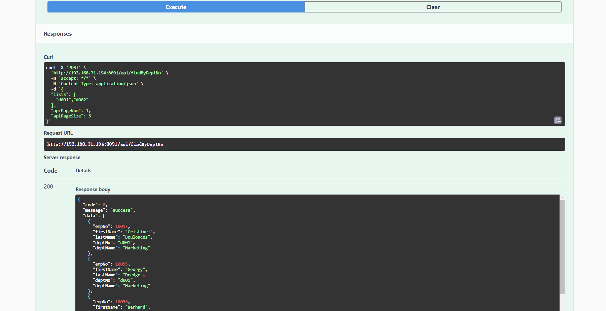
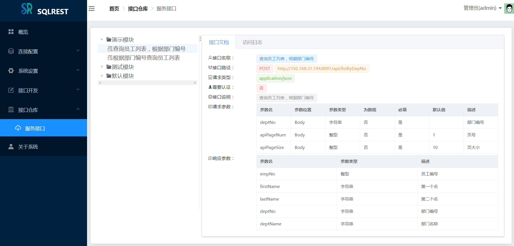

> 将 SQL 操作转化为 RESTful API的便捷工具

## 一、工具介绍

SQLREST 是一个开源项目，旨在提供一种简单而强大的方式来将 SQL 操作转化为 RESTful API。它支持多种数据库，允许用户通过配置 SQL 语句来创建 API，
无需编写复杂的后端逻辑，用户只需选择数据源、输入SQL或脚本、简单path配置即可快速生成API接口。

### 1、功能介绍

SQLREST的功能包括：

- **SQL直接构建API**：通过配置增删改查SQL和参数即可生成 RESTful API。
- **多数据库支持**：支持常见的20+种数据库，其中包含多款国产数据库。
- **MyBatis语法支持**：支持MyBatis的动态SQL语法。
- **Groovy脚本支持**：支持groovy语法构建复杂场景下的接口逻辑。
- **参数类型支持**：支持整型/浮点型/时间/日期/布尔/字符串/对象等多种类型。
- **ContentType支持**：支持application/x-www-form-urlencoded及application/json等多种入参请求格式。
- **身份认证支持**：提供基于Token的认证机制，保护API安全。
- **在线接口文档**：支持自动生成swagger和knife4j等在线接口文档。
- **缓存配置支持**：支持Hazelcast或Redis缓存，提升API访问性能。
- **流控配置管理**：通过Sentinel支持流量控制，防止系统过载。
- **统一告警对接**：支持统一告警系统的对接与触发。
- **RESTful接口转发**：支持HTTP数据源的RESTful接口转发功能。
- **文档数据库支持**：支持MongoDB和ElasticSearch等文档数据库开发接口。
- **接口版本管理**：支持接口的版本控制管理功能。
- **批量导入导出**：支持接口的批量导入导出功能。
- **大模型MCP服务**：支持简单配置即可创建MCP的tool。

SQLREST作为微服务架构下的数据访问中间件，适合以下场景：

- **快速将 SQL 转换为 API**
- **适用于数据中台、BI 工具、低代码平台等**

### 2、数据库清单

截至当前，已支持的数据库包括：

- 甲骨文的Oracle
- 微软的Microsoft SQLServer(2005+)
- MySQL
- MariaDB
- PostgreSQL/Greenplum
- IBM的DB2
- Sybase数据库
- 国产达梦数据库DM
- 国产人大金仓数据库Kingbase8
- 国产翰高数据库HighGo
- 国产神通数据库Oscar
- 国产南大通用数据库GBase8a
- Apache Hive
- Cloudera Impala
- SQLite3
- OpenGauss
- ClickHouse
- Apache Doris
- StarRocks
- OceanBase
- TDengine
- MongoDB
- ElasticSearch
- Http(RESTful)

### 3、模块结构功能


```
└── sqlrest
    ├── sqlrest-common           // sqlrest通用定义模块
    ├── sqlrest-mcp              // sqlrest的MCP协议模块
    ├── sqlrest-template         // sqlrest的SQL内容模板模块
    ├── sqlrest-cache            // sqlrest执行器缓存模块
    ├── sqlrest-persistence      // sqlrest的数据库持久化模块
    ├── sqlrest-core             // sqlrest接口核心实现模块
    ├── sqlrest-gateway          // Gateway网关节点
    ├── sqlrest-executor         // Executor执行节点
    ├── sqlrest-manager          // Manager管理节点
    ├── sqlrest-manager-ui       // WEB交互页面
    ├── sqlrest-dist             // 项目打包模块
```

### 4、正在规划中的功能

- **接口详情功能**: 支持接口的详细定义、数据来源、访问分析等功能。
- **语法提示增强**: 在实现的库名表名提示的基础上，基于数据库元信息的增强智能提示，强化用户体验。

## 二、编译打包

本工具纯Java语言开发，依赖全部来自于开源项目。SQLREST项目采用Maven构建。

### 1、编译打包

- 环境要求:

  **JDK**:>=1.8 （建议用JDK 1.8）

  **maven**:>=3.6
> Maven 仓库默认在国外， 国内使用难免很慢，可以更换为阿里云的仓库。
>  
> 参考教程： [配置阿里云的仓库教程](https://www.runoob.com/maven/maven-repositories.html)

- 编译命令:

**(1) windows下：**

```
 双击build.cmd脚本文件即可编译打包
```

**(2) Linux/MacOS下：**

```
git clone https://gitee.com/inrgihc/sqlrest.git
cd sqlrest/
sh ./build.sh
```

**(3) Docker下:**

```
git clone https://gitee.com/inrgihc/sqlrest.git
cd sqlrest/
sh ./docker-maven-build.sh
```

### 2、安装部署

(1) 当编译打包完成后，会在sqlrest/target/目录下生成sqlrest-release-x.x.x.tar.gz的打包文件，将文件拷贝到已安装JRE的部署机器上解压即可。

(2) 基于docker-compose提供linux联网环境下的一键安装，x86(arm下需自行制作docker镜像)的CentOS系统下安装命令如下：

```
curl -k -sSL https://gitee.com/inrgihc/sqlrest/attach_files/2241027/download -o /tmp/sr.sh && systemctl stop firewalld && bash /tmp/sr.sh && rm -f /tmp/sr.sh
```

文档详见: [build-docker/install/README.md](build-docker/install)

(3) 物理机方式部署

- 步骤1：准备好一个MySQL5.7+或PostgreSQL11+的数据库

> 当使用MySQL数据库时，config.ini里的DB_TYPE配置mysql,并需要配置 MYSQLDB_ 前缀的参数;
> 
> 当使用PostgreSQL数据库时，config.ini里的DB_TYPE配置postgres,并需要配置 PGDB_ 前缀的参数

- 步骤2：修改sqlrest-release-x.x.x/conf/config.ini配置文件

```
# manager节点的host地址，如果gateway与executor节点
# 与manager不在同一台机器时需要配置manger节点的IP地址
MANAGER_HOST=localhost


# manager的端口号
MANAGER_PORT=8090

# executor的端口号
EXECUTOR_PORT=8092

# gateway的端口号
GATEWAY_PORT=8091


# 数据库类型:mysql或postgres
DB_TYPE=mysql

# mysql的host地址
MYSQLDB_HOST=192.168.31.57
# mysql的端口号
MYSQLDB_PORT=3306
# mysql的库名
MYSQLDB_NAME=sqlrest
# mysql的账号
MYSQLDB_USERNAME=root
# mysql的密码
MYSQLDB_PASSWORD=123456

# pgsql的host地址
PGDB_HOST=192.168.31.57
# pgsql的端口号
PGDB_PORT=5432
# pgsql的库名
PGDB_NAME=sqlrest
# pgsql的账号
PGDB_USERNAME=postgres
# pgsql的密码
PGDB_PASSWORD=123456


# JSON序列化时区设置
JSON_TIMEZONE=Asia/Shanghai

# 数据源账号密码是否加密存储
SQLREST_DS_ENCRYPT=false

# 外部配置化网关/管理地址，默认为空
# SQLREST_MANAGER_URL=http://www.example.com:8090
# SQLREST_GATEWAY_URL=http://www.example.com:8091
```

>sqlrest的缓存支持使用分布式的hazelcast或者redis，在conf/{manager,gateway,executor}/目录下的application.yml配
>置文件中，可通过如下调整配置实用redis缓存，默认为使用hazelcast缓存(注意:manager/gateway/executor三者的缓存配置要一致)。

```
sqlrest:
  cache:
    hazelcast:
      # 是否开启使用hazelcast缓存
      enabled: false
    redis:
      # 是否开启使用redis缓存，开启时需要配置下面对应的redis信息
      enabled: true
      # 哨兵模式下不用配置host
      host: 127.0.0.1
      # 哨兵模式下不用配置port
      port: 6379
      password: 123456
      database: 0
      pool:
        min-idle: 1
        max-idle: 8
        max-active: 8
        max-wait: -1
        time-between-eviction-runs: -1
      # 非哨兵模式下删除掉sentinel整个节点
      sentinel:
        # 哨兵模式下需要配置master
        master: mymaster
        # 哨兵模式下需要配置nodes
        nodes: 127.0.0.1:26379,127.0.0.1:26380,127.0.0.1:26381
```

- 步骤3：如果为多主机节点部署，需要将sqlrest-release-x.x.x分发到其他主机节点上；如果为单机（单节点）部署可直接忽略本步骤。

- 步骤4：启动服务

> windows下，需按照如下顺序双击脚本启动对应的服务

启动manager服务：bin/manager_startup.cmd

启动executor服务：bin/executor_startup.cmd

启动gateway服务：bin/gateway_startup.cmd

> linux/macos下，需按照如下顺序执行脚本启动对应的服务

启动manager服务：sh bin/sqlrestctl.sh start manager

启动executor服务：sh bin/sqlrestctl.sh start executor

启动gateway服务：sh bin/sqlrestctl.sh start gateway

### 3、系统访问

启动完成后,通过http://<MANAGER_HOST>:<MANAGER_PORT> 地址即可访问。

登陆账号：```admin```  登陆密码：```123456```

## 三、使用教程

### 1、使用说明文档

[《SQLREST工具使用说明文档》](https://www.yuque.com/sanpang-jq7te/nys82g/hur636mthgyhaodb)

### 2、部分系统截图






## 四、贡献参与

为了能让项目得到更好的可持续的发展，SQLREST期望获得更多的代码开发爱好者参与代码贡献，包括但不限于：

- 改进前端 UI/UX
- 修复 bug 和性能优化
- 增加新的易用性功能

贡献操作文档参考：[贡献说明指南](https://gitee.com/inrgihc/dbswitch/blob/master/CONTRIBUTE.md)

## 五、项目推荐

[数据库迁移同步工具dbswitch] (https://gitee.com/inrgihc/dbswitch)

## 六、社区推荐

<div>
	<a href="https://dromara.org/zh/projects/" target="_blank">
        
    </a>
</div>

## 七、问题反馈

如果您看到并使用了本工具，或您觉得本工具对您有价值，请为此项目**点个赞**，以表示对本项目的支持，多谢！如果您在使用时遇到了bug，欢迎在issue中反馈。也可扫描下方二维码入群讨论：（加好友请注明："SQLREST交流"）


