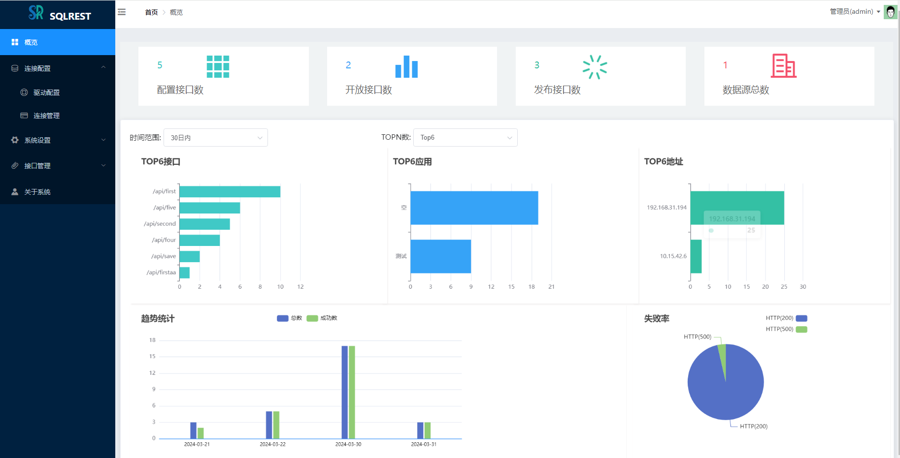
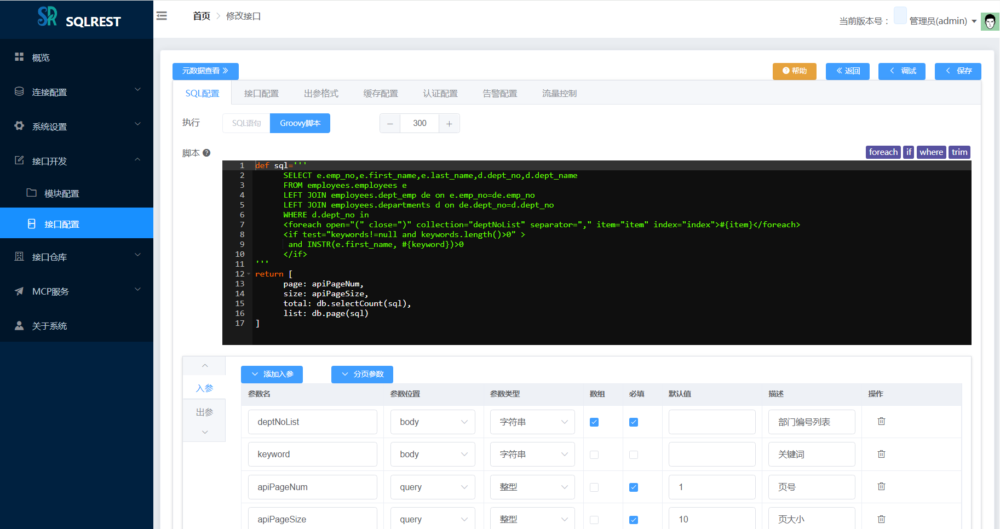
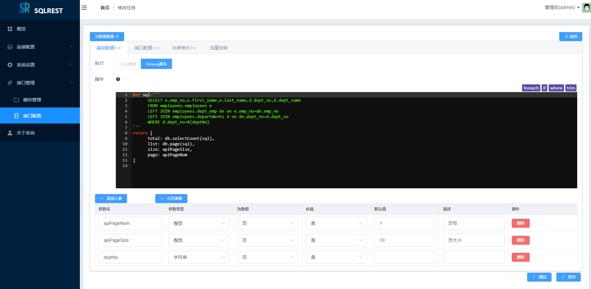
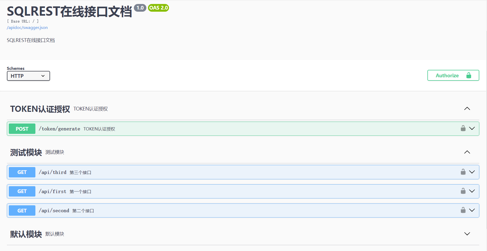
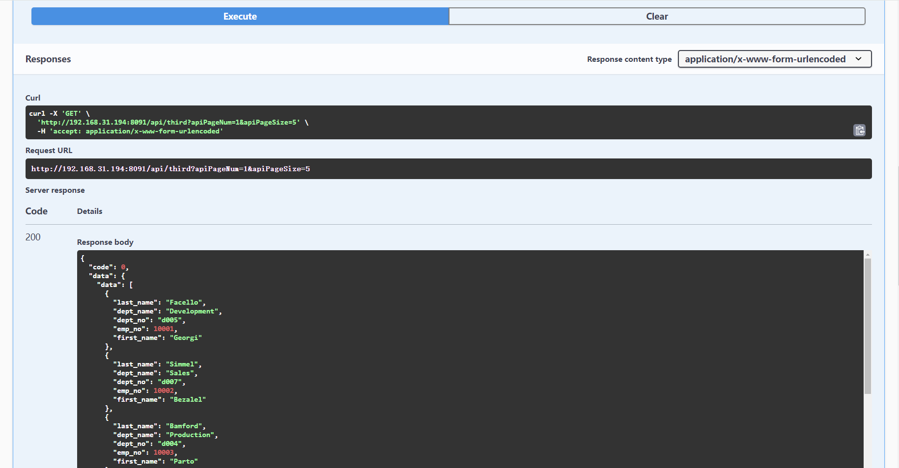
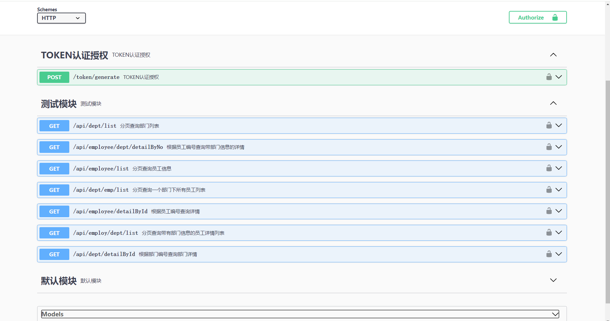

> 将数据库可执行的SQL直接RESTful风格的http接口的便捷工具

## 一、工具介绍

### 1、功能介绍

一句话, sqlrest提供利用SQL快速构建RESTful接口的工具，包括SQl方式和Groovy脚本方式。用户只需选择数据
源、输入SQL或脚本、简单path配置即可快速生成API接口。具体功能包括：

- Mybatis的SQL方式构建RESTful接口
> 提供类似mybatis的动态SQL语法方式构建接口。

- Groovy脚本方式构建RESTful接口
> 基于groovy脚本的语法方式构建复杂场景下的接口。

- 支持接口的token安全认证功能
> 执行器支持生成token及token认证。

- 支持接口的x-www-form-urlencoded和JSON入参格式
> HTTP入参支持application/x-www-form-urlencoded及application/json等请求格式。

- 接口入参出参支持基本、对象及对象等多种类型
> HTTP入参出参支持整型/浮点型/时间/日期/布尔/字符串/对象等多种类型

- 支持自动生成在线接口文档功能
> 基于swagger-ui提供自动生成在线接口文档功能。

- 支持接口缓存配置功能
> 执行器基于Hazelcast/Redis支持接口的缓存配置功能。

- 支持接口的流量控制功能
> 执行器基于sentinel支持接口的流量控制功能。

- 支持接口异常触发告警功能
> 执行器简单配置即可对接已有的告警平台,支持接口的异常告警功能。

### 2、支持的数据库

- 甲骨文的Oracle
- 微软的Microsoft SQLServer
- MySQL
- MariaDB
- PostgreSQL
- Greenplum(需使用PostgreSQL类型)
- IBM的DB2
- Sybase数据库
- 国产达梦数据库DM
- 国产人大金仓数据库Kingbase8
- 国产翰高数据库HighGo
- 国产神通数据库Oscar
- 国产南大通用数据库GBase8a
- Apache Hive
- SQLite3
- OpenGauss
- ClickHouse
- Apache Doris
- StarRocks
- OceanBase

### 3、模块结构功能


```
└── sqlrest
    ├── sqlrest-common           // sqlrest通用定义模块
    ├── sqlrest-template         // sqlrest的SQL内容模板模块
    ├── sqlrest-cache            // sqlrest执行器缓存模块
    ├── sqlrest-persistence      // sqlrest的数据库持久化模块
    ├── sqlrest-core             // sqlrest接口核心实现模块
    ├── sqlrest-gateway          // Gateway网关节点
    ├── sqlrest-executor         // Executor执行节点
    ├── sqlrest-manager          // Manager管理节点
    ├── sqlrest-manager-ui       // WEB交互页面
    ├── sqlrest-dist             // 项目打包模块
```

### 4、正在规划中的功能

- (1) 接口检索功能
> 支持类似百度搜索的接口搜索功能，方便接口查找

- (2) 接口详情功能
> 支持接口的详细定义、数据来源、访问分析等功能

- (3) 前端界面整体美化
> 美化界面的交互展示，尤其是“拓扑结构”页面。

## 二、编译打包

本工具纯Java语言开发，依赖全部来自于开源项目。

### 1、编译打包

- 环境要求:

  **JDK**:>=1.8 （建议用JDK 1.8）

  **maven**:>=3.6
> Maven 仓库默认在国外， 国内使用难免很慢，可以更换为阿里云的仓库。
>  
> 参考教程： [配置阿里云的仓库教程](https://www.runoob.com/maven/maven-repositories.html)

- 编译命令:

**(1) windows下：**

```
 双击build.cmd脚本文件即可编译打包
```

**(2) Linux下：**

```
git clone https://gitee.com/inrgihc/sqlrest.git
cd sqlrest/
sh ./build.sh
```

**(3) Docker下:**

```
git clone https://gitee.com/inrgihc/sqlrest.git
cd sqlrest/
sh ./docker-maven-build.sh
```

### 2、安装部署

(1) 当编译打包完成后，会在sqlrest/target/目录下生成sqlrest-relase-x.x.x.tar.gz的打包文件，将文件拷贝到已安装JRE的部署机器上解压即可。

(2) 基于docker-compose提供linux联网环境下的一键安装，x86的CentOS系统下安装命令如下：

```
curl -k -sSL https://gitee.com/inrgihc/sqlrest/attach_files/2210760/download -o /tmp/sr.sh && systemctl stop firewalld && bash /tmp/sr.sh && rm -f /tmp/sr.sh
```

文档详见: [build-docker/install/README.md](build-docker/install)

(3) 物理机方式部署

- 步骤1：准备好一个MySQL5.7+的数据库，假设连接地址如下：

| mysql的host地址 | mysql的端口号 | mysql的账号 | mysql的密码 |
| :------| :------ | :------ | :------ |
| 127.0.0.1 | 3306 | root | 123456 |

- 步骤2：修改sqlrest-relase-x.x.x/conf/config.ini配置文件

```
# manager节点的host地址，如果gateway与executor节点
# 与manager不在同一台机器时需要配置manger节点的IP地址
MANAGER_HOST=localhost


# manager的端口号
MANAGER_PORT=8090

# executor的端口号
EXECUTOR_PORT=8092

# gateway的端口号
GATEWAY_PORT=8091


# mysql的host地址
MYSQLDB_HOST=127.0.0.1

# mysql的端口号
MYSQLDB_PORT=3306

# mysql的库名
MYSQLDB_NAME=sqlrest

# mysql的账号
MYSQLDB_USERNAME=root

# mysql的密码
MYSQLDB_PASSWORD=123456
```

- 步骤3：如果为多主机节点部署，需要将sqlrest-release-x.x.x分发到其他主机节点上；如果为单机（单节点）部署可直接忽略本步骤。

- 步骤4：启动服务

> windows下，需按照如下顺序双击脚本启动对应的服务

启动manager服务：bin/manager_startup.cmd

启动executor服务：bin/executor_startup.cmd

启动gateway服务：bin/gateway_startup.cmd

> linux下，需按照如下顺序执行脚本启动对应的服务

启动manager服务：sh bin/sqlrestctl.sh start manager

启动executor服务：sh bin/sqlrestctl.sh start executor

启动gateway服务：sh bin/sqlrestctl.sh start gateway

### 3、高级配置

>sqlrest的缓存同时支持分布式嵌入的hazelcast和redis，在manager/gateway/executor的application.yml配
>置文件中，可通过如下配置所使用的缓存，默认为使用hazelcast缓存。

```
sqlrest:
  cache:
    hazelcast:
      # 是否开启使用hazelcast缓存
      enabled: true
    redis:
      # 是否开启使用redis缓存
      enabled: false
      host: 127.0.0.1
      port: 6379
      password: 123456
      database: 0
```

### 4、系统访问

启动完成后,通过http://<MANAGER_HOST>:<MANAGER_PORT> 地址即可访问。

登陆账号：```admin```  登陆密码：```123456```

## 三、使用教程

### 1、使用说明文档

[《SQLREST工具使用说明文档》](https://www.yuque.com/sanpang-jq7te/nys82g/hur636mthgyhaodb)

### 2、部分系统截图















## 四、贡献参与

为了能让项目得到更好的可持续的发展，sqlrest期望获得更多的代码开发爱好者参与代码贡献，具体可参考文档说明：[贡献说明指南](https://gitee.com/inrgihc/dbswitch/blob/master/CONTRIBUTE.md)

## 五、项目推荐

[数据库迁移同步工具dbswitch] (https://gitee.com/inrgihc/dbswitch)

## 六、问题反馈

如果您看到并使用了本工具，或您觉得本工具对您有价值，请为此项目**点个赞**，以表示对本项目的支持，多谢！如果您在使用时遇到了bug，欢迎在issue中反馈。也可扫描下方二维码入群讨论：（加好友请注明："SQLREST交流"）


